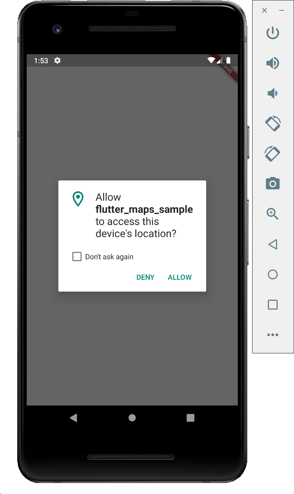
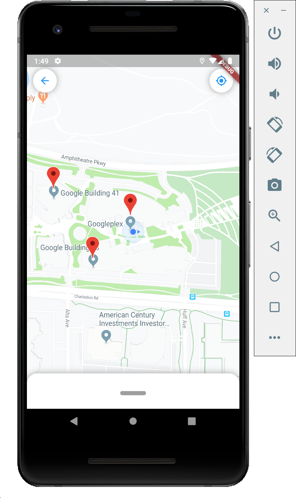
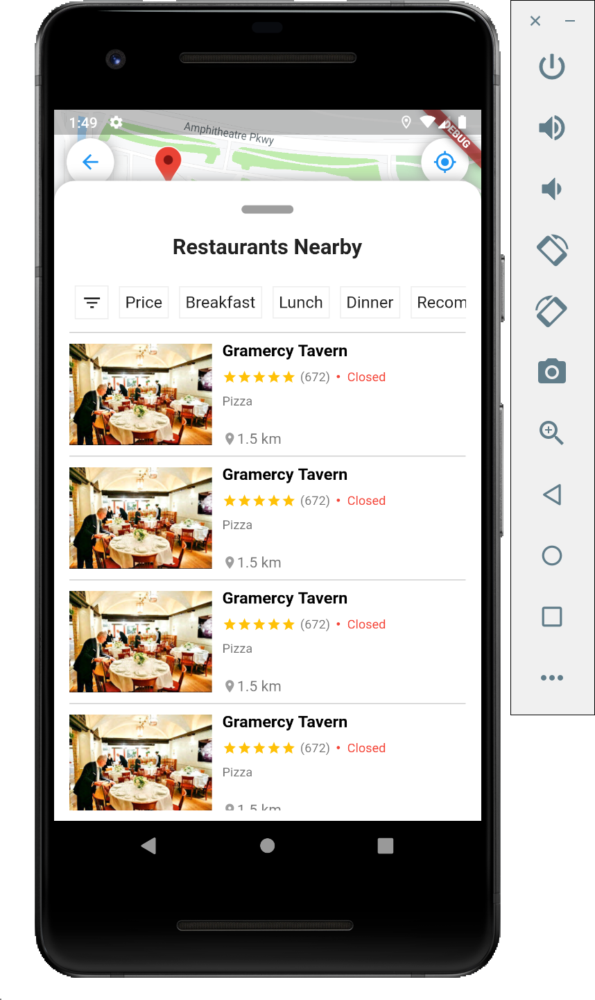
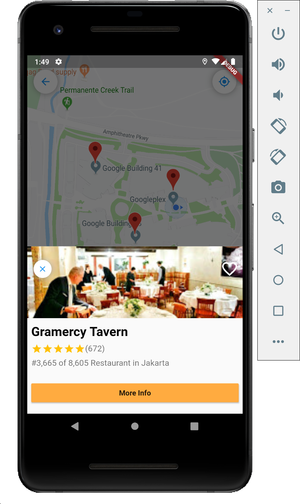
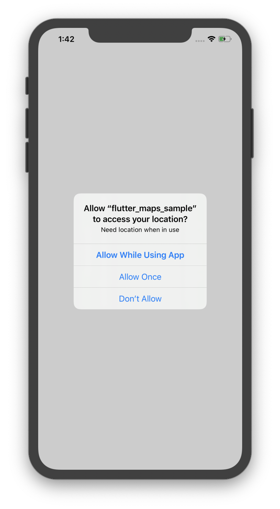
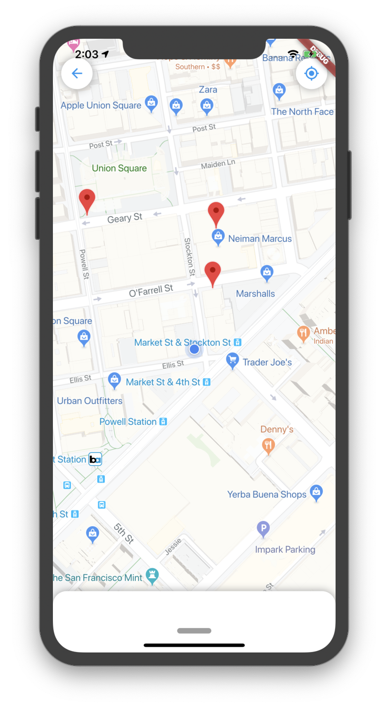
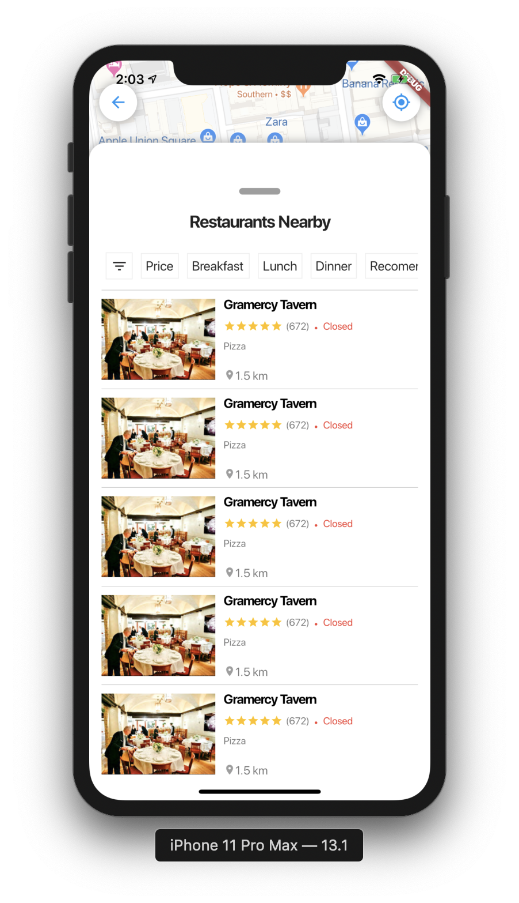
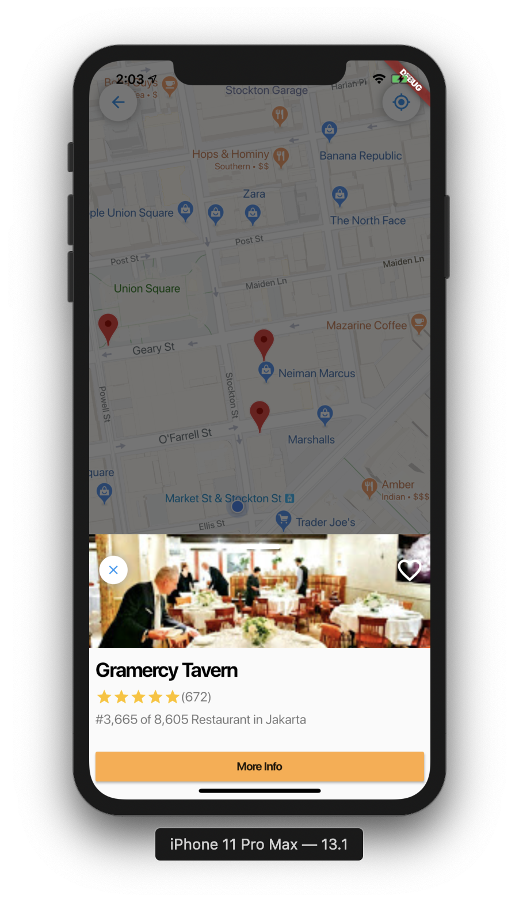

# Flutter Google Maps

Flutter application using Google Maps, Get Current Location (Devices), Markers, Camera Position, Bottom Sheet, DraggableScrollableSheet, etc 🔥.

Click this link to get your own <a href="https://console.developers.google.com/">API KEY</a>

### Screenshot on Android

<pre>
               
</pre>

### Screenshot on iOS

<pre>
               
</pre>

## Author

* **R Rifa Fauzi Komara**

Don't forget to follow and give me a ★
